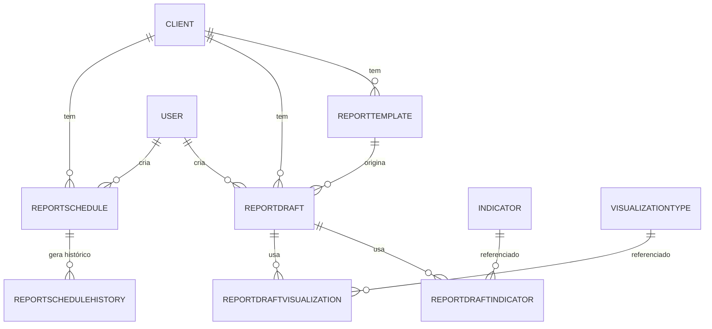

# Documentação do Banco de Dados do Fluxo de Relatórios (`report_app`)

## Visão Geral

Este documento detalha os models, esquemas e relações do banco de dados utilizados no ciclo de vida dos relatórios customizados.

---

## Models Principais

- Indicator
- VisualizationType
- ReportTemplate
- ReportDraft
- ReportDraftIndicator
- ReportDraftVisualization
- ReportSchedule
- ReportScheduleHistory

---

## Esquemas e Relações

### Detalhamento dos Models e Relações

#### **Indicator**
- `slug`: Slug único do indicador (`SlugField`, unique)
- `title`: Nome do indicador (`CharField`)
- `description`: Descrição detalhada (`TextField`)
- `category`: Categoria do indicador (ex: "Leading", "Lagging") (`CharField`)
- `data_category`: Categoria de dados (ex: "vendas", "financeiro") (`CharField`)
- `formula`: Fórmula de cálculo (`CharField`)
- **Relações:** Usado em vários drafts e templates via relações auxiliares.

---

#### **VisualizationType**
- `slug`: Slug único da visualização (`SlugField`, unique)
- `title`: Nome da visualização (`CharField`)
- `description`: Descrição (`TextField`)
- `chart_category`: Tipo de gráfico (ex: "bar", "line") (`CharField`)
- `data_category`: Categoria de dados associada (`CharField`)
- **Relações:** Usado em vários drafts e templates via relações auxiliares.

---

#### **ReportTemplate**
- `tenant`: Referência ao cliente/tenant (`ForeignKey` para Client)
- `name`: Nome interno do template (`CharField`)
- `title`: Título exibido ao usuário (`CharField`)
- `category`: Categoria do template (ex: "vendas", "financeiro") (`CharField`, choices)
- `description`: Descrição (`TextField`)
- `template_config`: Configuração JSON com indicadores, visualizações, etc. (`JSONField`)
- **Relações:** Pode ser referenciado por vários drafts.

---

#### **ReportDraft**
- `tenant`: Referência ao cliente/tenant (`ForeignKey`)
- `user`: Usuário criador (`ForeignKey`)
- `is_template`: Indica se foi criado a partir de um template (`BooleanField`)
- `template_ref`: Referência ao template usado (`ForeignKey`, nullable)
- `title`, `category`, `description`: Metadados do relatório (`CharField`/`TextField`)
- `status`: Status do draft no fluxo de criação (`CharField`, choices)
- `draft_config`: Configuração incremental do draft (`JSONField`)
- `created_at`, `updated_at`: Datas de criação/atualização
- **Relações:**
  - `draft_indicators`: Relação N:N com Indicator via `ReportDraftIndicator`
  - `draft_visualizations`: Relação N:N com VisualizationType via `ReportDraftVisualization`

---

#### **ReportDraftIndicator**
- `draft`: Referência ao draft (`ForeignKey`)
- `indicator`: Referência ao indicador (`ForeignKey`)
- `unique_together`: Garante que cada indicador só aparece uma vez por draft
- **Relações:** Relaciona drafts a indicadores selecionados.

---

#### **ReportDraftVisualization**
- `draft`: Referência ao draft (`ForeignKey`)
- `visualization`: Referência à visualização (`ForeignKey`)
- `unique_together`: Garante que cada visualização só aparece uma vez por draft
- **Relações:** Relaciona drafts a visualizações selecionadas.

---

#### **ReportSchedule**
- `tenant`: Referência ao cliente/tenant (`ForeignKey`)
- `user`: Usuário criador (`ForeignKey`)
- `name`: Nome do relatório agendado (`CharField`)
- `layout_config`: Configuração consolidada do relatório (`JSONField`)
- `frequency`: Frequência de envio (`CharField`, choices: daily, weekly, monthly)
- `schedule_config`: Parâmetros de agendamento e destinatários (`JSONField`)
- `channel`: Canal de envio (`CharField`, choices: email, whatsapp)
- `is_active`: Indica se o agendamento está ativo (`BooleanField`)
- `created_at`, `updated_at`: Datas de criação/atualização
- **Relações:**
  - `history`: Histórico de execuções via `ReportScheduleHistory`

---

#### **ReportScheduleHistory**
- `schedule`: Referência ao relatório agendado (`ForeignKey`)
- `sent_at`: Data/hora do envio (`DateTimeField`)
- `status`: Status do envio (`CharField`, choices: sent, error, skipped)
- **Relações:** Cada registro pertence a um `ReportSchedule`.

---

### Relações Resumidas

- **ReportTemplate** 1:N **ReportDraft** (via `template_ref`)
- **ReportDraft** N:M **Indicator** (via `ReportDraftIndicator`)
- **ReportDraft** N:M **VisualizationType** (via `ReportDraftVisualization`)
- **ReportSchedule** 1:N **ReportScheduleHistory** 

---

### Diagrama ER (Entidade-Relacionamento)



---

### Exemplos de JSON de Configuração

#### Exemplo de `template_config` em `ReportTemplate`
```json
{
  "indicators": ["faturamento-total", "lucro-bruto"],
  "visualizations": ["faturamento-por-tempo", "lucro-bruto-x-liquido"],
  "metadata": {
    "title": "Relatório Financeiro Mensal",
    "category": "financeiro",
    "description": "Acompanhamento mensal dos principais KPIs financeiros."
  }
}
```

#### Exemplo de `draft_config` em `ReportDraft`
```json
{
  "metadata": {
    "title": "Relatório de Vendas",
    "category": "vendas",
    "description": "KPIs de vendas do trimestre."
  },
  "indicators": ["ticket-medio", "conversao-geral"],
  "visualizations": ["funil-de-vendas", "vendas-por-canal"],
  "destinatarios": ["gestor@empresa.com", "diretoria@empresa.com"],
  "schedule": {
    "frequency_interval": 1,
    "frequency_unit": "month",
    "month_day": 1,
    "time_start": "08:00",
    "time_end": "10:00"
  }
}
```

#### Exemplo de `layout_config` e `schedule_config` em `ReportSchedule`
```json
{
  "layout_config": {
    "metadata": {
      "title": "Relatório de Vendas",
      "category": "vendas",
      "description": "KPIs de vendas do trimestre."
    },
    "indicators": ["ticket-medio", "conversao-geral"],
    "visualizations": ["funil-de-vendas", "vendas-por-canal"]
  },
  "schedule_config": {
    "frequency_interval": 1,
    "frequency_unit": "month",
    "month_day": 1,
    "time_start": "08:00",
    "time_end": "10:00",
    "destinatarios": ["gestor@empresa.com", "diretoria@empresa.com"]
  }
}
```

## Observações

- O modelo de dados pode ser expandido para suportar funcionalidades futuras, como edição e histórico detalhado. 