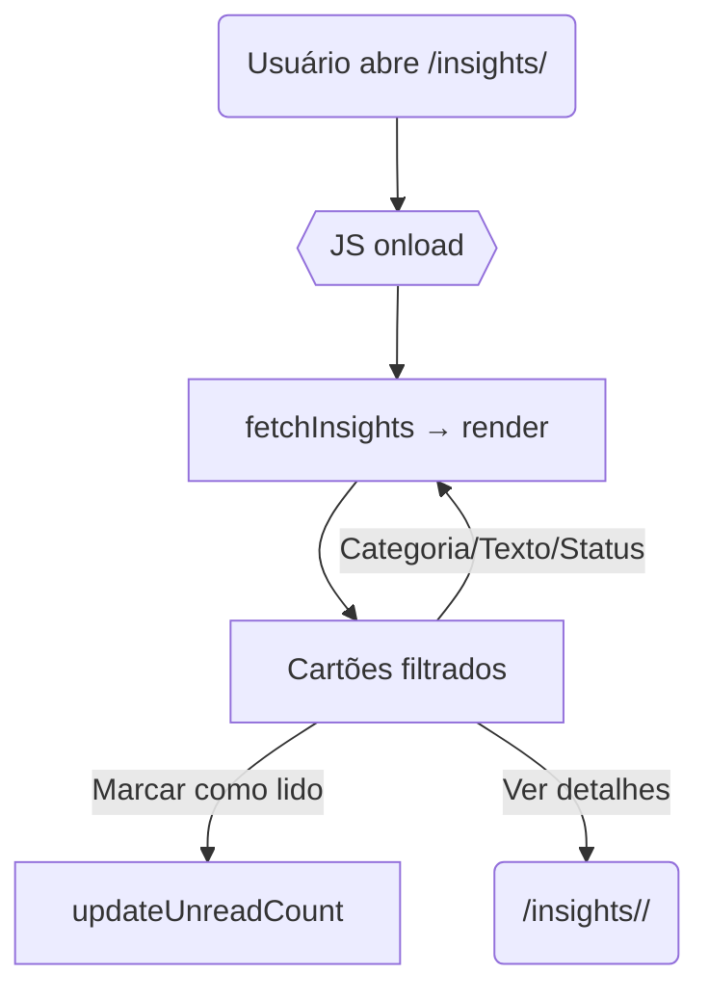

#  Documentação *Painel de Insights*   

## **Sumário**
1. [Visão Geral](#1---visão-geral)  
2. [Estrutura da Página](#2--estrutura-da-página)  
3. [Fluxo de Interação](#3---fluxo-de-interação)  
4. [Padrões de Design](#4---padrões-de-design)  
5. [Responsividade](#5---responsividade)  
6. [Componentes Críticos](#6---componentes-críticos)  
 

---

## 1 - Visão Geral
A página **Insights** apresenta recomendações acionáveis para o usuário, baseadas em análises dos dados cadastrados na *seerdot*.

- **Propósito:** concentrar sugestões de otimização em um único hub.  
- **Problema resolvido:** reduz a busca manual por oportunidades de melhoria.  
- **Integração no fluxo:** acessível via *Sidebar → Insights*; etapa de descoberta antes de relatórios ou painéis.

---

## 2- Estrutura da Página  

### 1. Barra de Filtros  
- **Função:** refinar por texto, status, categoria e data.  
- **Técnica:** `flex` container com campos `<input>` e `<select>`.  
- **Comportamento:** todos disparam `combineFilters()` para filtrar cartões em tempo real.  
- **Dependências:** Vanilla JS.

### 2. Pillbox de Categorias  
- **Função:** alternar conjunto de insights por área (Vendas, Marketing…).  
- **Técnica:** lista horizontal de botões `.category-pill`.  
- **Comportamento:** clique ativa classe `active` e chama `combineFilters()`.

### 3. Cartões de Insight (`.insight-card`)  
- **Função:** exibir título, resumo, KPI, **Ver detalhes** e *Marcar como lido*.  
- **Técnica:** `grid` responsiva (3→1 col.) + sombra leve.  
- **Comportamento:**  
  - *Marcar como lido* altera visual (opacidade 0.5) e atualiza contador.  
  - *Ver detalhes* abre `insight_detail.html`.  
- **Dependências:** Material Icons.

### 4. Paginação  
- **Função:** limitar render a 12 cartões/página.  
- **Técnica:** `<ul class="pagination">` alimentado via JS.  
- **Comportamento:** `updatePagination()` cria links, `showPage(n)` alterna.

### 5. Badge de Itens Não Lidos  
- **Função:** mostrar total de insights pendentes.  
- **Técnica:** `<span id="unreadCount">` atualizado via `updateUnreadCount()`.

---

## 3 - Fluxo de Interação  



### Lógica de Filtragem e Leitura

```js
function combineFilters() {
  const txt   = searchInput.value.toLowerCase();
  const cat   = activePill.dataset.category;
  const stat  = statusFilter.value;
  const start = dateStart.value;
  const end   = dateEnd.value;

  cards.forEach(c => {
    const matchTxt  = c.dataset.title.includes(txt);
    const matchCat  = !cat || c.dataset.category === cat;
    const matchStat = !stat || c.dataset.read === stat;
    const matchDate = (!start || c.dataset.date>=start) &&
                      (!end   || c.dataset.date<=end);
    c.style.display = (matchTxt && matchCat && matchStat && matchDate)
                      ? 'flex' : 'none';
  });
}

function markAsRead(card){
  fetch(`/insights/read/${card.dataset.id}`, {method:'POST',headers:{'X-CSRFToken':csrf}})
    .then(()=> card.classList.add('read'))
    .then(updateUnreadCount);
}

markAllBtn.onclick = () => {
  document.querySelectorAll('.insight-card:not(.read)')
    .forEach(markAsRead);
};
```

---

## 4 -  Padrões de Design

| Elemento             | Estilo                                                             |
|----------------------|--------------------------------------------------------------------|
| **Fonte global**     | `'Exo 2', sans-serif`                                              |
| **Cores principais** | `#23CE6B` (verde), `#188C48` (hover), `#969696` (cinza), `#FCFCFC` |
| **Cartões**          | `border-radius: 8px; box-shadow: 0 2px 4px rgba(0,0,0,.1)`         |
| **Botão hover**      | fundo `#CDF8E8`, texto/ícone `#188C48`                             |
| **Tooltip**          | fundo branco; borda + texto verdes, seta CSS                       |

---

## 5 -  Responsividade

| Breakpoint              | Ajustes                                                 |
|-------------------------|---------------------------------------------------------|
| **Desktop > 992 px**    | Grade 3 colunas (`grid-template-columns:repeat(3,1fr)`) |
| **Tablet 768–992 px**   | Grade 2 colunas                                         |
| **Mobile < 768 px**     | Grade 1 coluna; filtros empilham verticalmente          |

---

## 6 -  Componentes Críticos  

Elementos da interface que são indispensáveis para o funcionamento da página — aqueles que, se forem alterados ou quebrar, comprometem a experiência principal do usuário ou a lógica de negócio.

### Insight Card

```html
<div class="insight-card unread" data-category="vendas" id="insight-42">
  <h3 class="title">Aumente a taxa de conversão</h3>
  <p class="excerpt">Teste novos CTAs na página de checkout…</p>
  <button class="detail-btn">Ver detalhes</button>
  <button class="read-btn">Marcar como lido</button>
</div>
```

- **Regra de negócio:** inicia com classe `unread`; clique em `.read-btn` remove a classe e decrementa badge.  
- **Acessibilidade:** contraste AA; botões têm `aria-label`.

### Insight Detail

- Exibe título, gráfico **Chart.js** e tabela de métricas.  
- **Gerar PDF** usa `html2canvas` + `jsPDF`.

```js
exportPDF.onclick = () => {
  html2canvas(document.querySelector('.detail-body')).then(canvas=>{
    const pdf = new jsPDF('p','mm','a4');
    pdf.addImage(canvas,'PNG',10,10,190,0);
    pdf.save('insight.pdf');
  });
};
```

---

> **Última atualização:** 11 jul 2025