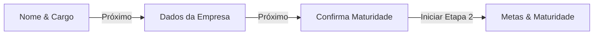
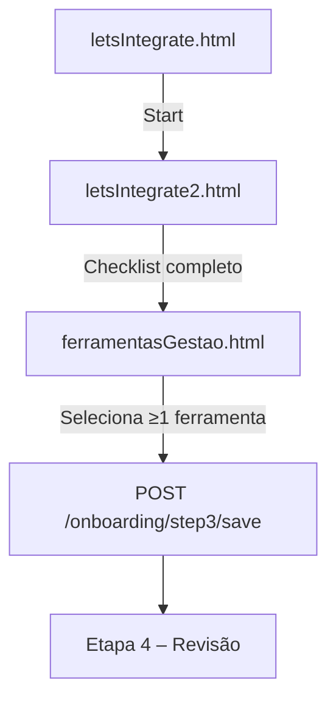
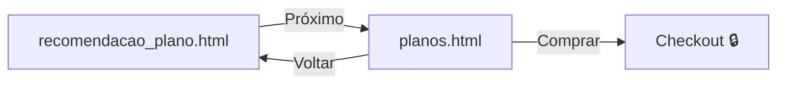

# 🛫 Onboarding — *Etapa 1* (Perfil Básico)  

Esta documentação descreve o fluxo de onboarding da plataforma **seerdot**.  
O fluxo completo possui quatro partes sequenciais:

1. [Etapa 1 – Perfil Básico](#etapa-1-perfil-basico)  
2. [Etapa 2 – Metas & Maturidade](#etapa-2-metas-maturidade)  
3. [Etapa 3 – Integrações de Dados](#etapa-3-integracoes-de-dados)  
4. [Etapa 4 – Revisao & Conclusao](#etapa-4-revisao-conclusao)   


---

## 🎯 Visão Geral do Onboarding

Após criar a conta, o usuário é conduzido por um **wizard de 4 etapas** que coleta dados essenciais para personalizar relatórios, recomendações e métricas.  
A Etapa 1 foca em **identificar o usuário e o contexto da empresa**.

> **Objetivo de UX**  
> • Diminuir barreiras de entrada.  
> • Garantir que as primeiras recomendações sejam realmente relevantes.  

---

# Onboarding — Etapa 1 (Estrutura de arquivos) 


| Template / Asset                | Propósito                                          |
|---------------------------------|----------------------------------------------------|
| `baseStep1.html`                | Layout geral (painel esquerdo fixo + painel direito configurável) |
| `getNameRole.html`              | Sub‑passo 1.1 – Nome completo & Cargo              |
| `getCompanyInfos.html`          | Sub‑passo 1.2 – Dados da empresa                   |
| `letsProceedOnboarding.html`    | Sub‑passo 1.3 – Confirmação de maturidade          |
| `segments_list.html`            | Lista de segmentos de mercado (autocomplete)       |
| `areas_list.html`               | Lista de áreas internas (autocomplete)             |
| `onboarding.css`                | Estilos compartilhados para todo o wizard          |

---

## ⏩ Fluxo de Navegação (Etapa 1)



A navegação é feita **sem recarregar a aplicação inteira**: cada sub‑passo é renderizado pelo Django como página própria mas reaproveita `baseStep1.html`, mantendo o painel esquerdo fixo. A sensação de continuidade vem dos IDs e classes consistentes e de **transições CSS** discretas (fade‑in na direita).

---

## ✏️ Etapa 1 — Perfil Básico <a id="etapa-1-perfil-basico"></a>

### Sub‑passo 1.1 — Nome & Cargo (`getNameRole.html`)

| Aspecto          | Detalhe |
|------------------|---------|
| **Campos**       | `#nomeCompleto`, `#cargo` (input + `datalist`) |
| **Validação**    | Botão `.submit-button` ativo somente quando ambos preenchidos |
| **Persistência** | Valores salvos em `localStorage` (`userName`, `userRole`) |
| **Acessibilidade** | `<label>` associado e `aria-required="true"` |

```html
<input id="nomeCompleto" name="nome" required />
<input id="cargo" list="lista-cargos" required />
<datalist id="lista-cargos">
  <option value="CEO"><option value="Data Analyst">
</datalist>
```

---

### Sub‑passo 1.2 — Dados da Empresa (`getCompanyInfos.html`)

| Campo | Fonte de dados | Notas de UI |
|-------|----------------|-------------|
| **Segmento** | `segments_list.html` | Autocomplete filtrável |
| **Área principal** | `areas_list.html` | Seleção múltipla opcional |
| **Tamanho (funcionários)** | `<select>` estático | Faixas numéricas |
| **Maturidade de dados** | Radio buttons (Iniciante / Intermediário / Avançado) | Controla texto do sub‑passo 1.3 |

#### Validação em tempo real

```js
const required = form.querySelectorAll('[required]');
function check() {{
  submit.disabled = ![...required].every(i=>i.value);
}}
required.forEach(i=>i.addEventListener('input', check));
```

---

### Sub‑passo 1.3 — Confirmação e Continuação (`letsProceedOnboarding.html`)

- Exibe saudação com o **nome** salvo e mensagem contextual baseada na maturidade.  
- Botão **“Começar Etapa 2”** envia `POST /onboarding/step2/start`.

---

## 🎨 Padrões de Design Relevantes

* **Fonte global:** `'Exo 2', sans-serif`  
* **Cor primária:** `#23CE6B` • **Hover:** `#188C48`  
* **Botões desativados:** `opacity: 0.5; cursor: not-allowed`  
* **Barra de progresso:** altura 6 px, anima de `width: 0 → 33%` via `.animate-progress`  

---

## 📱 Responsividade Rápida

| Viewport | Layout |
|----------|--------|
| **≥ 992 px** | Painel esquerdo (40 %) + form direito (60 %) |
| **768‑991 px** | Painel esquerdo encolhe para 30 %, conteúdo direito 70 % |
| **≤ 767 px** | Painel esquerdo colapsa; formulário toma 100 % |

---

## ✅ Checklist — Etapa 1

- [x] Captura de perfil pessoal (nome & cargo)  
- [x] Captura de perfil organizacional (segmento, área, tamanho)  
- [x] Validação client‑side e feedback de botão ativo/inativo  
- [x] Barra de progresso visual  
- [x] Layout responsivo até 320 px  
- [x] Acessibilidade mínima (labels & contraste)

---

# Onboarding — Etapa 2 (Objetivo & Desafios de Dados) <a id="etapa-2-metas-maturidade"></a>

---

## Visão Geral
A segunda etapa do onboarding coleta **metas de negócio** e **principais desafios de dados** do cliente.  
Essas informações guiam o algoritmo de recomendação da *seer.app*, permitindo gerar um **plano inicial** alinhado às prioridades do usuário.

- **Problema resolvido:** entender o *por‑quê* da integração antes de sugerir features ou KPIs.  
- **Saída esperada:** • `primary_goal` • `data_challenges[]` • flags de segmentação.  
- **Integração:** POST para */api/onboarding/step‑2/*; navega para Etapa 3 após sucesso.

---

## 🏗️ Estrutura da Página
| Nº | Componente | Função | Arquivo | Notas |
|----|------------|--------|---------|-------|
| 1 | **Barra de progresso** | Indica 50 % concluído | `baseStep2.html` | `.progress-bar::before` animado de 25→50 % |
| 2 | **Pane Esquerdo** | Mensagem motivacional | `baseStep2.html` | `.left-panel` fixa, rola independente |
| 3 | **Top‑bar** | Botão Voltar ← + indicador “Etapa 2/4” | `baseStep2.html` | classe `.back-button` |
| 4 | **Bloco de Objetivos** | 4 cartões clicáveis (`.objective-option`) | `getGoal.html` | Seleção única |
| 5 | **Bloco Desafios** | Lista scrollável de checkbox (`.challenge-option`) | `dataChallenges.html` | Seleção múltipla + tooltips |
| 6 | **Botão Próximo** | Avança para Etapa 3 | `baseStep2.html` | `.submit-button` habilita quando requisitos ok |

---

## Comportamento & Lógica
```js
/** habilita botão quando há um goal e ≥1 challenge */
function updateSubmitState(){
  const okGoal = document.querySelector('.objective-option.active');
  const okCh   = document.querySelector('.challenge-option.active');
  submitBtn.classList.toggle('active', !!okGoal && !!okCh);
}

goalCards.forEach(c=>c.onclick = () =>{
  goalCards.forEach(x=>x.classList.remove('active'));
  c.classList.add('active');
  updateSubmitState();
});

challengeOptions.forEach(opt=>{
  opt.onclick = () =>{
    opt.classList.toggle('active');
    updateSubmitState();
  };
});

/* tooltips */
icon.addEventListener('mouseenter', showTooltip);
icon.addEventListener('mouseleave', hideTooltip);
```

### Navegação
1. **Voltar:** `window.history.back()`  
2. **Próximo:** envia payload via `fetch` + header `X‑CSRFToken`; `location.href = '/onboarding/step‑3/'`.

---

## Design System
- **Tipografia:** `'Exo 2', sans‑serif` (32 px título, 20 px subtítulo).  
- **Cores-chave:**  
  | Token | Hex | Uso |
  |-------|-----|-----|
  | `primary‑green` | `#23CE6B` | progresso, botão ativo |
  | `dark‑green` | `#188C48` | hover, foco |
  | `grey‑bg` | `#DFDFDF` | fundo neutro |
  | `card‑white` | `#FFFFFF` | cartões & inputs |

- **Hover / Active:** cartões ganham `border-color: #188C48` e texto verde.  
- **Inputs padrão:** 375×50 px, `border-radius: 10px`, `background: #dfdfdf`.

---

## Responsividade
| Viewport | Layout |
|----------|--------|
| **≥ 1200 px** | Coluna esquerda 30 %, direita 70 % |
| **Tablet (992–1199)** | Painéis mantêm proporção, texto reduz 90 % |
| **Mobile (< 768)** | Painéis viram *stack* vertical; progress‑bar fixa; cartões 100 % largura |

---

## IDs, Classes & Dependências
```text
.progress-bar         // animada via keyframes
.objective-option     // card de objetivo (data-goal-id)
.challenge-option     // item de desafio (data-challenge-id)
.submit-button        // botão Próximo
#tooltips-container   // wrapper fixo para tooltips dinâmicos
```
**CSS:** `onboardingSetp2.css` fileciteturn15file3  
**JS libs:** nenhuma externa; apenas Vanilla JS + `fetch`.

---

## Checklist de Requisitos
- [x] Barra de progresso animada 25 → 50 %  
- [x] Seleção única de objetivo  
- [x] Seleção múltipla de desafios  
- [x] Tooltip acessível (`.tooltip::after`)  
- [x] Validação habilita botão Próximo  
- [x] Responsivo até 320 px  

---


# 🛫 Onboarding — *Etapa 3* (Integrações de Dados) <a id="etapa-3-integracoes-de-dados"></a>


## Visão Geral

A **Etapa 3** do onboarding coleta as **integrações de dados** que o cliente já utiliza para que a *seerdot* possa conectar‑se automaticamente às fontes corretas.

- **Propósito:** identificar ferramentas (ERP, CRM, BI etc.) e preparar conectores.  
- **Problema resolvido:** elimina configuração manual posterior e acelera o time‑to‑value.  
- **Integração no fluxo:** sucede *Metas & Desafios*; ao concluir, o usuário vai para **Etapa 4 – Revisão & Conclusão**.

---

## 🏗️ Estrutura da Página  <a id="estrutura-da-página"></a>

### 1. Layout Base (`baseStep3.html`)
- **Função:** casca geral com painel esquerdo motivacional + painel direito dinâmico.  
- **Técnica:** `grid` 2 colunas; barra de progresso fixa (`.progress-bar`) chega a **75 %**.  
- **Comportamento:** botão **Voltar** retorna `window.history.back()`.  
- **Dependências:** nenhuma biblioteca externa. fileciteturn18file2L1-L25

### 2. Resumo de Integrações (`letsIntegrate.html`)
- **Função:** saudar usuário pelo nome e explicar por que conectar ferramentas.  
- **Técnica:** texto + botão **Vamos começar** (`.start-btn`).  
- **Comportamento:** clique vai para `/onboarding/step3/tools`. fileciteturn18file3L1-L20

### 3. Teste de Conectividade (`letsIntegrate2.html`)
- **Função:** exibe *checklist animado* (roteiro, chaves de API, criação de conta…).  
- **Técnica:** lista `<li>` com `setTimeout()` que troca ícone *spinner → check*.  
- **Comportamento:** após todos ticks, redireciona para seleção de ferramentas.  
- **Dependências:** Material Icons + Vanilla JS. fileciteturn18file4L20-L50

### 4. Seleção de Ferramentas (`ferramentasGestao.html`)
- **Função:** grade de cartões com ERPs/CRMs populares; permite múltipla escolha.  
- **Técnica:** `flex-wrap` + modais de busca (`#searchTools`).  
- **Comportamento:**  
  - Clicar em cartão ativa classe `selected`.  
  - Botão **Continuar** habilita quando ≥1 selecionado.  
- **Dependências:** ícones SVG locais. fileciteturn18file5L30-L80

---

## 📈 Fluxo de Interação  <a id="fluxo-de-interação"></a>



### Lógica principal (pseudocódigo)

```js
// letsIntegrate2.html
const steps = [...document.querySelectorAll('.check-item')];

function runChecklist(idx=0){
  if(idx >= steps.length){return next();}
  const el = steps[idx];
  el.classList.add('checking');
  setTimeout(()=>{
     el.classList.replace('checking','done');
     runChecklist(idx+1);
  },1500);
}

function toggleTool(card){
  card.classList.toggle('selected');
  nextBtn.disabled = !document.querySelector('.selected');
}
```

---

## 🎨 Padrões de Design  <a id="padrões-de-design"></a>

| Elemento          | Estilo                                                          |
|-------------------|-----------------------------------------------------------------|
| **Fonte global**  | `'Exo 2', sans-serif`                                           |
| **Progresso 75 %**| `.progress-bar::before { width: 75% ; background:#23CE6B; }`    |
| **Cartão Tool**   | fundo `#fff`, borda `1px solid #969696`, `border-radius: 8px`   |
| **Cartão Selecionado** | `border-color: #188C48; box-shadow:0 0 8px rgba(0,0,0,.2)` |
| **Botões ativos** | fundo `#23CE6B`, hover `#188C48`, texto branco                  |

---

## 📱 Responsividade  <a id="responsividade"></a>

| Breakpoint            | Ajustes principais                                           |
|-----------------------|--------------------------------------------------------------|
| `≥ 1200 px` (Desktop) | Grade 4 colunas de cartões (25 % cada)                       |
| `992–1199 px`         | Grade 3 colunas                                              |
| `768–991 px`          | Grade 2 colunas; painel esquerdo encolhe 25 %               |
| `< 768 px` (Mobile)   | Painel esquerdo some; grade 1 coluna; botão fixa bottom      |

---

## Pontos Críticos  <a id="componentes-críticos"></a>

| Componente | Por que é crítico? | Seletores‑chave |
|------------|-------------------|-----------------|
| **Checklist Animado** | Garante percepção de progresso e prepara usuário para ação seguinte. | `.check-item`, `.check-icon` |
| **Grade de Ferramentas** | Captura integrações; sem ela, personalização falha. | `.tool-card.selected`, `data-tool-id` |
| **Botão Continuar** | Avança para Etapa 4 e envia payload; bloqueio evita avanço inválido. | `#continueBtn` |

---

## ✅ Checklist — Etapa 3

- [x] Barra de progresso até 75 %  
- [x] Checklist animado com timers sequenciais  
- [x] Seleção múltipla de ferramentas e validação de botão  
- [x] Persistência em `localStorage` (`selectedTools`)  
- [x] Acessibilidade: foco visível + `aria-checked` em cartões  
- [x] Responsivo até 320 px  

---

# 🛫 Onboarding — *Etapa 4* (Revisao & Conclusao) <a id="etapa-4-revisao-conclusao"></a>


A etapa final do wizard de onboarding **encerra a configuração inicial** apresentando
um **plano recomendado** e permitindo que o usuário **escolha ou altere** sua assinatura
antes de começar a usar a plataforma.

---

## 🎯 Visão Geral
Depois de coletar **perfil, objetivos e integrações** nas etapas anteriores,
o sistema calcula a melhor oferta de serviço.  
Nesta tela o usuário *revê* essa recomendação e **finaliza** o onboarding ao
selecionar um dos planos disponíveis.

---

## 🏗️ Estrutura de Arquivos
| Arquivo / Template | Propósito |
|--------------------|-----------|
| `baseStep4.html` | Esqueleto da etapa 4: barra de progresso, **painel esquerdo estático** e **painel direito dinâmico** fileciteturn19file1L18-L26 |
| `recomendacao_plano.html` | Sub‑passo 4.1 – mostra mensagem com **plano sugerido** e botão *Próximo* fileciteturn19file0L13-L23 |
| `planos.html` | Sub‑passo 4.2 – lista de **cartões de plano** com preços, features e botão *Comprar* fileciteturn19file2L17-L26 |
| `onboardingStep4.css` | Estilos específicos: progress‑bar 95 %, grid de planos, badge “RECOMENDADO” fileciteturn19file5L26-L34 |

---

## 🔄 Fluxo de Navegação



*Barra de progresso* aumenta de **75 % → 95 %** ao carregar a etapa 4,
indicando conclusão iminente.

---

## 🧩 Componentes Principais

### 1. Barra de Progresso  
- **Função:** reforçar que o usuário está a um passo da finalização.  
- **Técnica:** pseudo‑elemento `::before` que parte de 75 % e anima até 95 %  fileciteturn19file5L26-L41  
- **Comportamento:** classe `.animate-progress` adicionada on‑load.

### 2. Painel Esquerdo  
- **Função:** mensagem motivacional e branding constante.  
- **Técnica:** `position: fixed; width: 30 %`; rolagem independente.  
- **Conteúdo:** logo + texto com spans `.highlight` verdes.

### 3. Card de **Recomendação de Plano** (Sub‑passo 4.1)  
- **Função:** mostrar resumo dos dados coletados e sugerir o plano ideal.  
- **HTML chave:** parágrafo `#mensagemRecomendacao` recebe contexto via Django.  
- **Botão:** `.next-button` avança para seleção de planos.

### 4. **Cartões de Plano** (`.plan`)  
- **Função:** permitir que o usuário compare e compre o serviço.  
- **Estrutura técnica:**  
  ```html
  <div class="plan plan-recommended" id="planoBasico">
      <div class="recommendation-badge">RECOMENDADO</div>
      <div class="plan-title">
        <span class="material-icons-outlined">star_rate</span>
        <span>Básico</span>
      </div>
      <div class="plan-price"><span>R$ 275</span>/mês</div>
      <!-- switch mensal/annual + botão .compra-plano -->
  </div>
  ```  
  fileciteturn19file2L18-L31  
- **Destaque:** o plano indicado vem com classe `plan-recommended`
  que pinta borda/ sombra e exibe `RECOMENDADO`.

### 5. Switch **Mensal × Anual**  
- **Função:** atualizar preço e badge “MELHOR VALOR”.  
- **Interação:** clique nos elementos `.plan-switch-item` alterna
  classes `active-left / active-right` e troca texto **R$**.

### 6. Botões **Comprar**  
- **IDs:** `#basico`, `#pro` (exemplo).  
- **Comportamento:** `onclick` dispara rota `/checkout/` (a definir).

---

## 🎨 Padrões de Design
| Elemento | Valor |
|----------|-------|
| **Fonte** | `'Exo 2', sans‑serif` |
| **Cor primária** | `#23CE6B` (botões, barra) |
| **Hover** | `#188C48` |
| **Badge recomendado** | fundo `#23CE6B`, texto branco |
| **Cartões** | `border-radius: 8px; box-shadow: 0 2 4px rgba(0,0,0,.1)` |

---

## 📱 Responsividade
| Largura | Ajuste |
|---------|--------|
| `≥ 1200 px` | Painel esquerdo 30 %, grid de planos 3 colunas |
| `992 – 1199` | Planos em 2 colunas |
| `< 768` | Painel esquerdo colapsa; planos empilham 1 coluna; badge e preço centralizados |

---

## ✅ Checklist
- [x] Barra de progresso animada até 95 %  
- [x] Plano recomendado destacado automaticamente  
- [x] Alternância mensal / anual atualiza preço  
- [x] Todos botões têm estados *hover* e *disabled* coerentes  
- [x] Layout responsivo ≥ 320 px  
- [x] Sem dependências externas além de Bootstrap & Material Icons  

---


> **Última atualização:** 11 jul 2025
