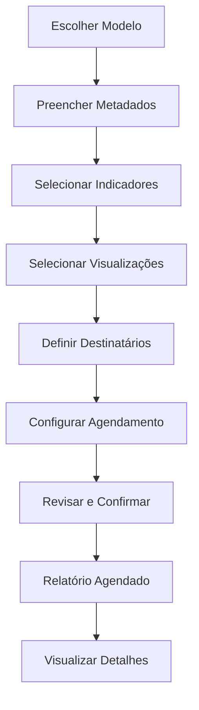

# Documentação do Frontend do Fluxo de Relatórios (`report_app`)

## Visão Geral

Este documento detalha as telas, o fluxo de navegação e as interações do usuário no processo de criação, edição e visualização de relatórios customizados na plataforma.

---

## Telas Principais e Fluxo

1. **Escolha do Modelo de Relatório**
2. **Configuração de Metadados**
3. **Seleção de Indicadores**
4. **Seleção de Visualizações**
5. **Definição de Destinatários e Canais**
6. **Configuração de Agendamento**
7. **Revisão e Confirmação**
8. **Listagem e Visualização de Relatórios**

---

## Detalhamento das Telas

### 1. **Escolha do Modelo de Relatório** (`modelos.html`)
- **Objetivo:** O usuário escolhe entre iniciar um relatório em branco ou a partir de um modelo pré-configurado.
- **Componentes:**
  - Lista de modelos disponíveis, com título, categoria, indicadores e visualizações sugeridas.
  - Filtros por categoria.
  - Botão para avançar após seleção.
  - Modal de confirmação para sair do fluxo.
- **Ações:** Selecionar modelo e avançar para a próxima etapa.

---

### 2. **Configuração de Metadados** (`metadados.html`)
- **Objetivo:** Definir título, categoria e descrição do relatório.
- **Componentes:**
  - Formulário com campos: Título, Categoria (dropdown), Descrição (textarea).
  - Validação obrigatória dos campos.
  - Botão para avançar e voltar.
- **Ações:** Preencher e validar campos, avançar para seleção de indicadores.

---

### 3. **Seleção de Indicadores** (`indicadores.html`)
- **Objetivo:** Escolher os indicadores (KPIs) que farão parte do relatório.
- **Componentes:**
  - Lista de indicadores disponíveis, com título, descrição e categoria (Leading/Lagging).
  - Filtros por tipo de indicador.
  - Campo de busca.
  - Seleção múltipla (checkbox).
  - Botão para avançar e voltar.
- **Ações:** Selecionar um ou mais indicadores, filtrar/buscar, avançar.

---

### 4. **Seleção de Visualizações** (`visualizacoes.html`)
- **Objetivo:** Definir os tipos de gráficos/tabelas para exibir os dados dos indicadores.
- **Componentes:**
  - Lista de visualizações disponíveis, com título, descrição, tipo de gráfico e categoria de dados.
  - Campo de busca.
  - Seleção múltipla (checkbox).
  - Botão para avançar e voltar.
- **Ações:** Selecionar visualizações, avançar.

---

### 5. **Definição de Destinatários e Canais** (`destinatarios_canais.html`)
- **Objetivo:** Informar os e-mails dos destinatários do relatório.
- **Componentes:**
  - Campo para digitar e-mails (com chips para múltiplos).
  - Validação de e-mail.
  - Campo de canais (desabilitado, "em breve").
  - Botão para avançar e voltar.
- **Ações:** Adicionar/remover e-mails, avançar.

---

### 6. **Configuração de Agendamento** (`agendamentos.html`)
- **Objetivo:** Definir a periodicidade e horários de envio do relatório.
- **Componentes:**
  - Seleção de frequência (diária, semanal, mensal).
  - Seleção de dias da semana ou dia do mês, conforme frequência.
  - Seleção de intervalo de horário para envio.
  - Botão para avançar e voltar.
- **Ações:** Configurar agendamento, avançar.

---

### 7. **Revisão e Confirmação** (`revisao.html`)
- **Objetivo:** Revisar todas as escolhas feitas antes de finalizar/agendar o relatório.
- **Componentes:**
  - Resumo expandível de cada etapa: metadados, indicadores, visualizações, destinatários, agendamento.
  - Botão para confirmar e finalizar.
  - Loader/feedback visual de criação.
- **Ações:** Revisar, voltar para editar, confirmar/agendar.

---

### 8. **Listagem e Visualização de Relatórios** (`relatorios.html`, `detail.html`)
- **Objetivo:** Exibir todos os relatórios agendados, permitir filtro, busca e acesso aos detalhes.
- **Componentes:**
  - Tabela/lista de relatórios com nome, categoria, agendamento, último envio, ações (editar, desativar, excluir).
  - Filtros por categoria, status, data.
  - Botão para criar novo relatório.
  - Link para detalhes do relatório.
- **Ações:** Filtrar, buscar, acessar detalhes, criar novo, editar, desativar/excluir. 

---

## Fluxo Visual (Mermaid)

---

## Observações

- O fluxo pode ser expandido para contemplar edição, compartilhamento e envio de relatórios futuramente. 